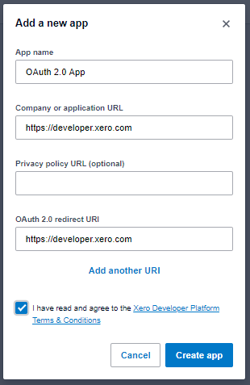
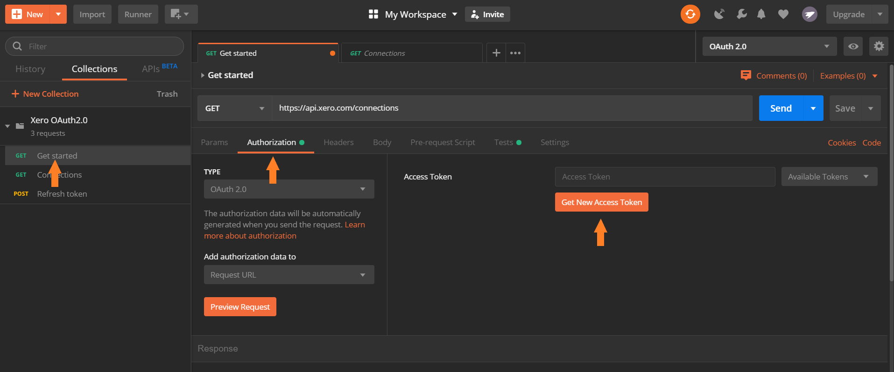
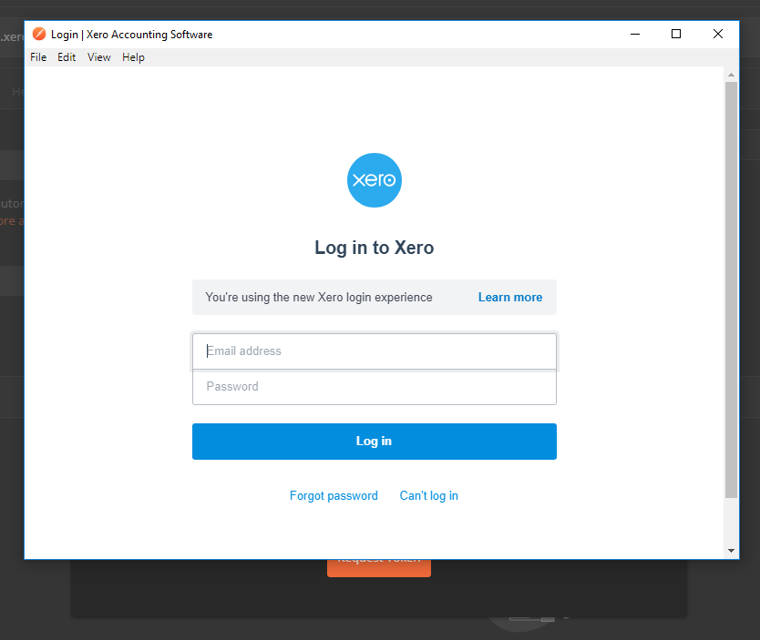
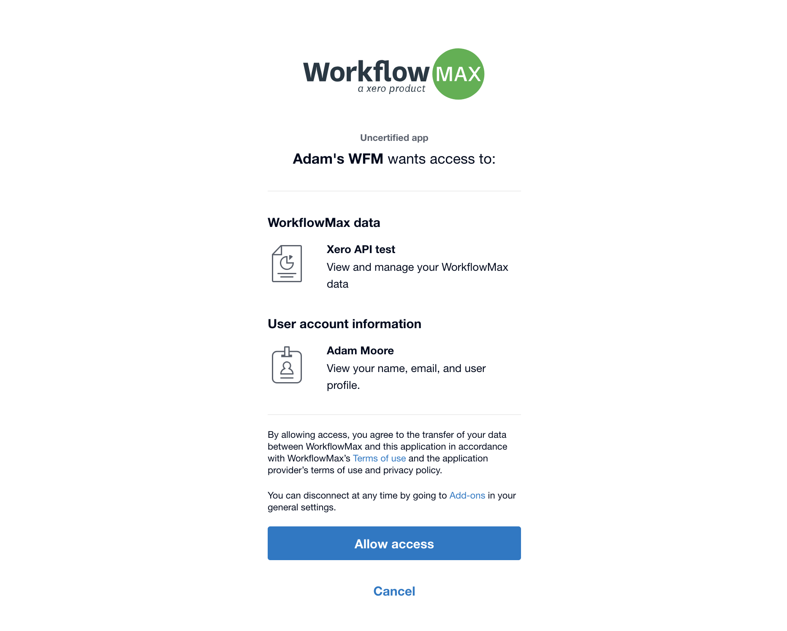
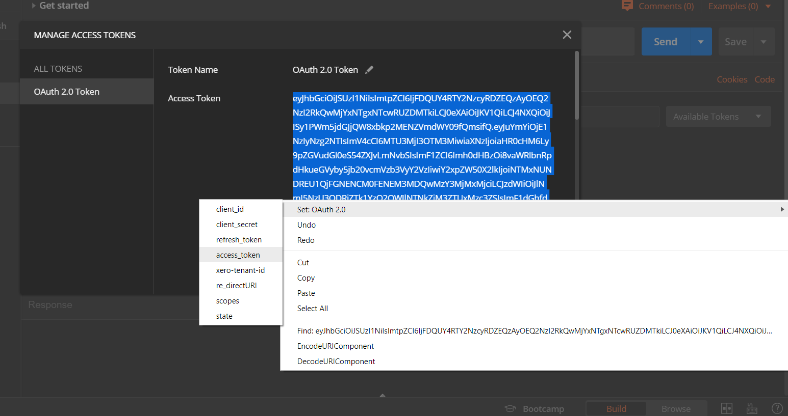

# Xero-Postman WorkflowMax OAuth 2.0
A Postman collection for authenticating to the WorkflowMax API using OAuth 2.0.

## Steps to get up and running
Follow these steps to quickly get up and running with the WorkflowMax API and Postman:

### 1. Import the Xero OAuth 2.0 collection and Xero environment into Postman
Click the button below and select the Desktop version of Postman (Chrome extension doesn't support environment variables). This will also install the Collection and Environment we'll be using.

Alternatively, you can download the Xero OAuth2.0.postman_collection and OAuth 2.0.postman_environment JSON files above and import them via the Import button in the top left of the Postman Workplace sceen.

### 2. Create an OAuth2 app at https://developer.xero.com/myapps
Go to the Xero developer portal and create an OAuth2 app.

If you haven't already signed up for a xero account you can do so [here](https://www.xero.com/signup/api/).

Use the following values:
* App Name - your choice, but can't contain the word 'Xero'
* Company or application URL - this needs to be an https address, but isn't used.
* OAuth 2.0 redirect URI - also needs to be https but won’t be used in postman

Then:
1. Click Create App
1. Click Generate a secret
1. Keep the page open

### 3. Add your first set of environment variables in Postman
Copy the Client id, Client secret and OAuth 2.0 redirect URI from the My Apps screen into the environment variables in Postman. To add these details to the Environment, make sure you have the OAuth 2.0 Environment selected, click the eye button, then edit.

### 4. Add the scopes for the endpoints you will be accessing.
Our Developer Center lists the available scopes [here](https://developer.xero.com/documentation/oauth2/scopes). For getting started you will need at least:

`offline_access workflowmax`

In addition, to make further test calls we would also suggest adding:

`openid profile email`

Add the scopes required to the `scopes` environment variable.

### 5. Ensure you have API Access privileges
Go to your [staff list in WorkflowMax](https://my.workflowmax.com/admin/resourcelist.aspx) and click on your user name. Scroll to the very bottom of the page and tick "Authorise 3rd Party Full Access"

### 6. Generate your access token
1. Double-click on the GET Get Started request under the Xero OAuth 2.0 Collection
1. Select the Authorization tab
1. Select "Request URL" in the "Add authorization data to" dropdown menu
1. Click Get New Access Token

1. Add the Variable names surrounded by {{}} from your Environment into the fields, as shown in the screenshot below
1. Add https://login.xero.com/identity/connect/authorize to the Auth URL field
1. Add https://identity.xero.com/connect/token to the Access Token Field
1. Click Request Token

At this stage you will be prompted to log in to Xero.

You'll be taken through to the account Select window. Select the account you want to connect to. If you want to connect to more than one account, you can repeat the steps above and select another account.

If you've included the `openid profile email` scopes, you'll also be asked to access your basic profile information.

If you see a message saying you have no WorkflowMax accounts go back and complete step  5. "Ensure you have API Access privileges"

Once complete you'll be passed back to Postman.

### 6. Set your Access and Refresh Tokens
We now have the last remaining tokens needed to access the Xero API. These need to be set to the Environment Variables, to do this:
1. Highlight the Access Token
1. Right-click on it
1. Select Set: OAuth 2.0 > access_token

Follow the same process for the Refresh Token.

### 7. Find out which tenants (accounts) we are connected to

1. Double-click on the GET Connections request
1. Click Send
1. Like we did for the Access and Refresh Tokens, highlight the tenantId from the response, right click and select Set > OAuth 2.0 > xero-tenant-id

Congrats! You're now authenticated and can start making API calls. Your access token will last for 12mins, after which time you'll need to refresh the token.

### 8. Make your first API call!
1. Double-click to load the GET Invoices request
1. Ensure No Auth is set on the Authorization tab
1. Click Send

### 9. Refreshing the token
1. Double-click to load the POST Refresh token request
1. Ensure No Auth is set on the Authorization tab
1. Click Send

### Notes:
* We use the built in OAuth 2.0 support to get the token, however we then set this as an environment variable. So we don't need to use this support when making the normal API calls.
